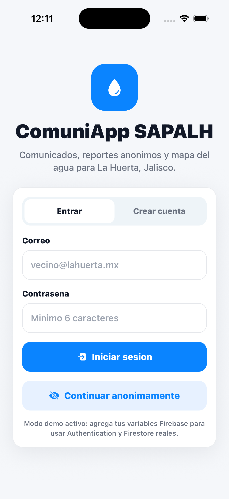
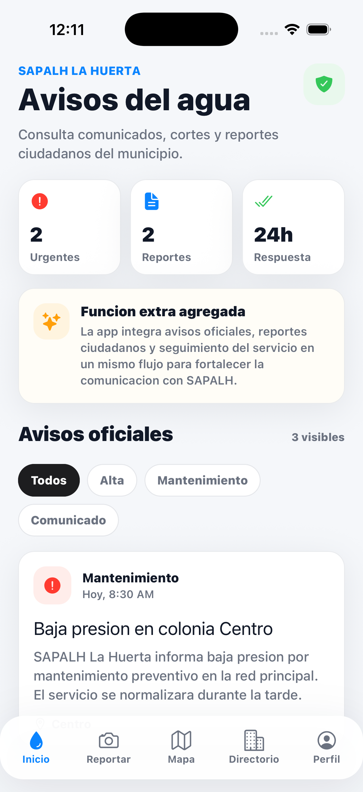
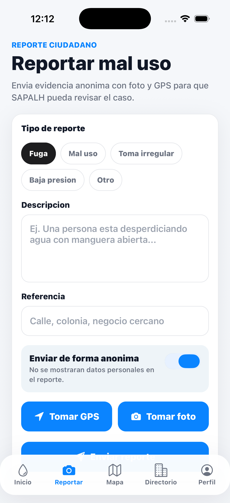
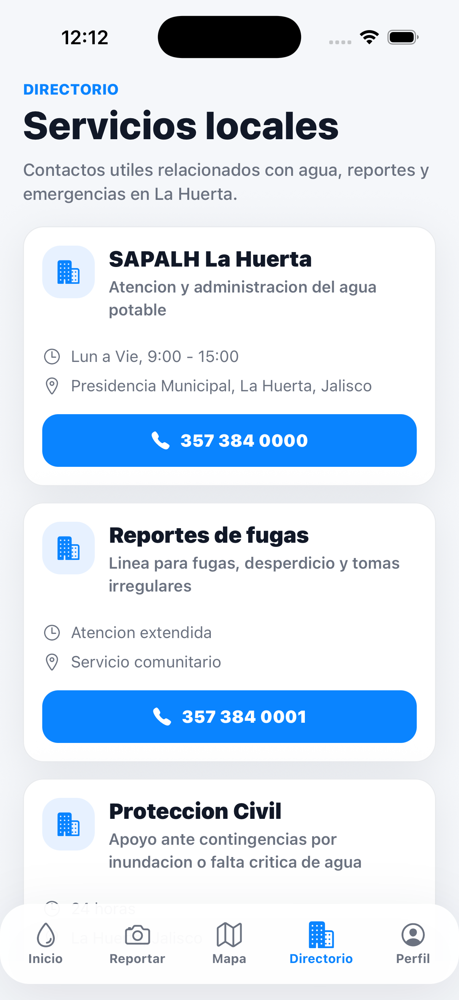
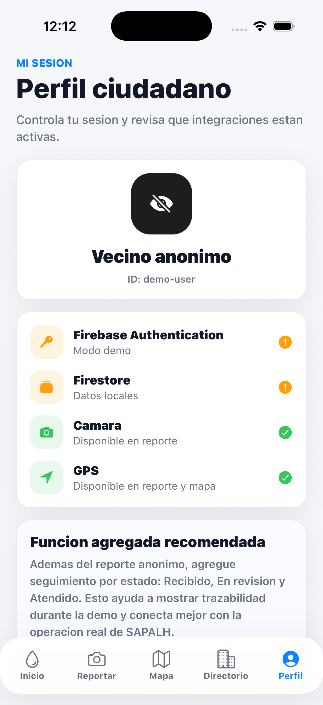
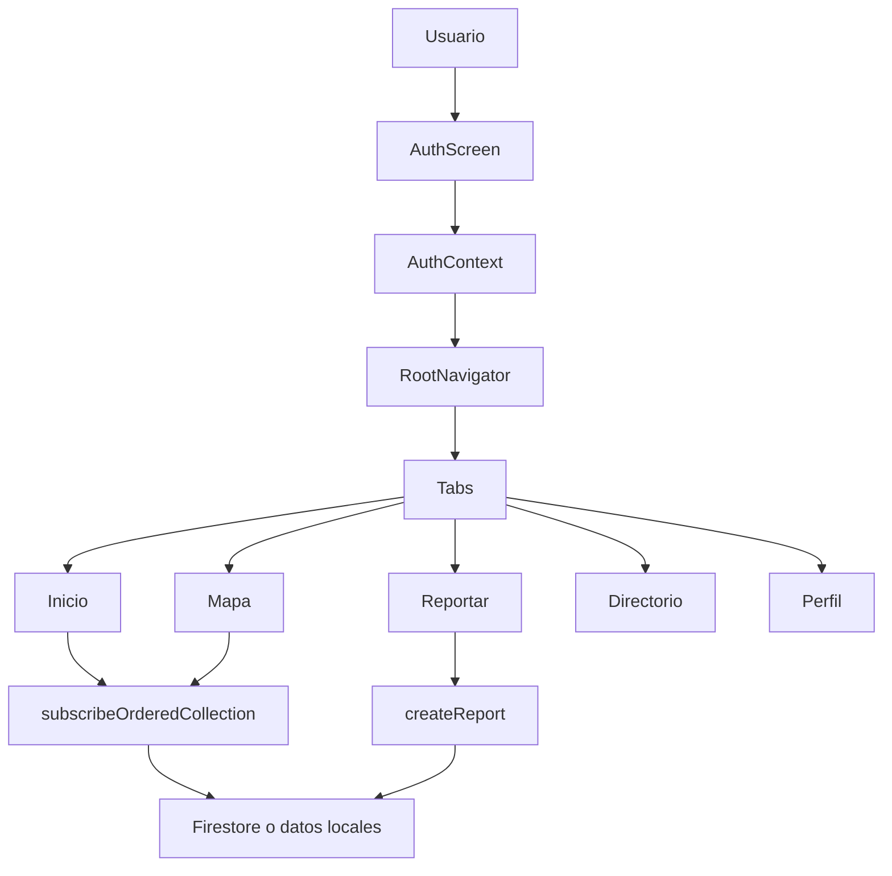
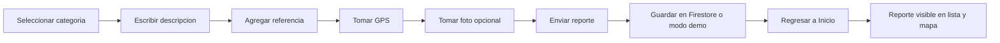

# ComuniApp SAPALH La Huerta

Aplicacion movil hibrida desarrollada con React Native, Expo, Firebase, Firestore y React Navigation para apoyar la comunicacion entre SAPALH La Huerta y la comunidad del municipio de La Huerta, Jalisco.

La idea central es que los habitantes puedan consultar comunicados sobre el servicio de agua, reportar de forma anonima el mal uso del agua, ubicar puntos de interes en un mapa y encontrar telefonos utiles relacionados con el servicio.

El proyecto esta pensado para cumplir los requisitos del Proyecto Integrador "ComuniApp" y tambien para funcionar como demo completa en Expo Go, emulador o dispositivo fisico.

## Indice

- [Descripcion general](#descripcion-general)
- [Capturas de pantalla](#capturas-de-pantalla)
- [Funciones principales](#funciones-principales)
- [Cumplimiento de requisitos](#cumplimiento-de-requisitos)
- [Tecnologias utilizadas](#tecnologias-utilizadas)
- [Arquitectura de la aplicacion](#arquitectura-de-la-aplicacion)
- [Estructura del proyecto](#estructura-del-proyecto)
- [Pantallas de la app](#pantallas-de-la-app)
- [Botones y comportamiento](#botones-y-comportamiento)
- [Firebase Authentication y Firestore](#firebase-authentication-y-firestore)
- [Modo demo sin Firebase](#modo-demo-sin-firebase)
- [Instalacion y ejecucion](#instalacion-y-ejecucion)
- [Ejecucion en simulador iOS](#ejecucion-en-simulador-ios)
- [Ejecucion en Expo Go fisico](#ejecucion-en-expo-go-fisico)
- [Generar APK](#generar-apk)
- [Validaciones y pruebas realizadas](#validaciones-y-pruebas-realizadas)
- [Diseno UX/UI estilo Apple](#diseno-uxui-estilo-apple)
- [Guion sugerido para demo](#guion-sugerido-para-demo)
- [Solucion de problemas comunes](#solucion-de-problemas-comunes)
- [Mejoras futuras](#mejoras-futuras)

## Descripcion general

ComuniApp SAPALH La Huerta es una aplicacion comunitaria enfocada en el servicio de agua potable. SAPALH es la institucion local encargada de administrar el agua, comunicar avisos, atender reportes, detectar mal uso del recurso y apoyar la operacion del servicio.

La app resuelve cuatro necesidades principales:

1. Centralizar avisos oficiales sobre cortes, baja presion, mantenimiento y campanas de cuidado del agua.
2. Permitir reportes ciudadanos anonimos con descripcion, referencia, ubicacion GPS y evidencia fotografica.
3. Mostrar en un mapa interactivo oficinas, infraestructura y reportes recientes.
4. Ofrecer un directorio rapido de telefonos utiles para atencion, fugas y emergencias.

La aplicacion tambien incluye una funcion extra recomendada: seguimiento por estado del reporte. Cada reporte puede aparecer como `Recibido`, `En revision` o `Atendido`, lo que ayuda a explicar mejor el flujo de trabajo de SAPALH durante la presentacion.

## Capturas de pantalla

Las siguientes capturas fueron tomadas desde el simulador iOS con Expo Go. Estan guardadas en `docs/screenshots` para que el README funcione como documentacion visual del entregable.

| Login y acceso | Inicio con avisos | Formulario de reporte |
|---|---|---|
|  |  |  |

| Mapa interactivo | Directorio local | Perfil ciudadano |
|---|---|---|
|  |  |  |

## Funciones principales

- Navegacion inferior entre `Inicio`, `Reportar`, `Mapa`, `Directorio` y `Perfil`.
- Pantalla principal con avisos oficiales, metricas rapidas, filtros y reportes recientes.
- Formulario validado para levantar reportes ciudadanos.
- Reporte anonimo activado por defecto.
- Captura de ubicacion con GPS mediante `expo-location`.
- Captura de evidencia fotografica con `expo-camera`.
- Mapa interactivo con `react-native-maps`.
- Marcadores para oficina, infraestructura, pozo municipal y reportes ciudadanos.
- Directorio de servicios con botones de llamada.
- Perfil con estado de integraciones: Firebase Authentication, Firestore, camara y GPS.
- Cierre de sesion funcional.
- Modo demo local cuando no existen credenciales Firebase.
- Componentes reutilizables para mantener consistencia visual y organizacion del codigo.
- Diseno responsivo con una interfaz limpia inspirada en iOS.

## Cumplimiento de requisitos

| Requisito del proyecto | Estado | Implementacion |
|---|---:|---|
| React Native | Cumplido | Proyecto construido con React Native dentro de Expo. |
| Expo | Cumplido | Scripts `npm start`, `npm run ios`, `npm run android`, `npm run web`. |
| Firebase | Cumplido | Servicio centralizado en `src/services/firebase.js`. |
| Firestore | Cumplido | Lectura de `notices` y escritura/subscripcion de `reports`. |
| Firebase Authentication | Cumplido | Login con correo/contrasena, registro y acceso anonimo. |
| React Navigation | Cumplido | Stack principal y Bottom Tabs en `App.js`. |
| Navegacion entre pantallas | Cumplido | 5 pestanas principales. |
| Pantalla principal con reportes | Cumplido | Avisos, filtros, metricas y reportes recientes. |
| Mapa interactivo con marcadores | Cumplido | `MapView` y `Marker` en `MapScreen.js`. |
| Formularios validados | Cumplido | Validacion de login y reporte ciudadano. |
| Uso de camara | Cumplido | `CameraView` y permisos de camara en `ReportScreen.js`. |
| Uso de GPS | Cumplido | `Location.requestForegroundPermissionsAsync` y coordenadas del reporte. |
| Componentes reutilizables | Cumplido | `Card`, `Header`, `Screen`, `PrimaryButton`, `FormInput`, `NoticeCard`, `ReportCard`. |
| Diseno responsivo y UX adecuada | Cumplido | Tema centralizado, tarjetas, tabs flotantes, jerarquia visual y estados de carga. |
| Demo funcional | Cumplido | Probada en Expo Go sobre simulador iOS. |

## Tecnologias utilizadas

| Tecnologia | Uso dentro del proyecto |
|---|---|
| React Native | Construccion de la interfaz movil. |
| Expo | Ejecucion, permisos nativos, camara, GPS y desarrollo rapido. |
| Firebase | Conexion con servicios cloud. |
| Firebase Authentication | Autenticacion con correo/contrasena y sesion anonima. |
| Firestore | Base de datos para avisos y reportes. |
| React Navigation | Navegacion con stack y tabs. |
| Expo Camera | Captura de fotografias para evidencias. |
| Expo Location | Permisos y geolocalizacion GPS. |
| React Native Maps | Mapa interactivo con marcadores. |
| Expo Vector Icons | Iconografia tipo iOS mediante Ionicons. |
| ESLint Expo | Revision de calidad basica del codigo. |

## Arquitectura de la aplicacion

La aplicacion esta organizada con una separacion simple: `App.js` define la navegacion, `src/screens` contiene las pantallas, `src/components` contiene UI reutilizable, `src/services` concentra Firebase y `src/data` mantiene datos demo.



### Flujo del reporte ciudadano



## Estructura del proyecto

```text
.
|-- App.js
|-- app.json
|-- eas.json
|-- package.json
|-- README.md
|-- .env.example
|-- docs/
|   `-- screenshots/
|       |-- 01-login.png
|       |-- 02-inicio.png
|       |-- 03-reportar.png
|       |-- 04-mapa.png
|       |-- 05-directorio.png
|       `-- 06-perfil.png
`-- src/
    |-- components/
    |   |-- Card.js
    |   |-- FormInput.js
    |   |-- Header.js
    |   |-- NoticeCard.js
    |   |-- PrimaryButton.js
    |   |-- ReportCard.js
    |   `-- Screen.js
    |-- context/
    |   `-- AuthContext.js
    |-- data/
    |   `-- mockData.js
    |-- screens/
    |   |-- AuthScreen.js
    |   |-- DirectoryScreen.js
    |   |-- HomeScreen.js
    |   |-- MapScreen.js
    |   |-- ProfileScreen.js
    |   `-- ReportScreen.js
    |-- services/
    |   `-- firebase.js
    `-- theme.js
```

## Pantallas de la app

### 1. AuthScreen

Pantalla inicial para entrar a la aplicacion.

Incluye:

- Segmento `Entrar`.
- Segmento `Crear cuenta`.
- Campo de correo.
- Campo de contrasena.
- Boton `Iniciar sesion` o `Crear cuenta` segun el modo.
- Boton `Continuar anonimamente`.
- Mensaje de modo demo cuando Firebase no esta configurado.

Validaciones:

- El correo debe contener `@`.
- La contrasena debe tener al menos 6 caracteres.
- Si Firebase no esta configurado, el login entra automaticamente al modo demo para permitir la presentacion.

### 2. HomeScreen

Pantalla principal de comunicados y reportes.

Incluye:

- Encabezado `Avisos del agua`.
- Metricas: avisos urgentes, reportes y tiempo estimado de respuesta.
- Tarjeta de funcion extra agregada.
- Filtros de comunicados: `Todos`, `Alta`, `Mantenimiento`, `Comunicado`.
- Avisos oficiales.
- Reportes recientes.
- Buenas practicas de cuidado del agua.

Funcion importante:

- Se suscribe a Firestore para obtener `notices` y `reports`.
- Si no hay Firebase, usa datos locales demo.
- Cuando se envia un nuevo reporte en modo demo, el listado se actualiza en la misma sesion.

### 3. ReportScreen

Pantalla para levantar reportes anonimos.

Incluye:

- Seleccion de categoria:
  - `Fuga`
  - `Mal uso`
  - `Toma irregular`
  - `Baja presion`
  - `Otro`
- Campo de descripcion.
- Campo de referencia.
- Switch para enviar de forma anonima.
- Boton `Tomar GPS`.
- Boton `Tomar foto`.
- Boton `Enviar reporte`.

Validaciones:

- La descripcion debe tener minimo 15 caracteres.
- La referencia debe tener minimo 5 caracteres.
- Se debe capturar ubicacion GPS antes de enviar.

Comportamiento:

- Al tomar GPS, se guarda latitud y longitud.
- Al tomar foto, se abre la camara nativa.
- En simulador, si la camara falla, existe evidencia demo para poder completar la presentacion.
- Al enviar, el reporte se guarda con estado `Recibido`.
- Despues de enviar, la app regresa a `Inicio` y muestra alerta de confirmacion.

### 4. MapScreen

Pantalla de mapa interactivo.

Incluye:

- Mapa de La Huerta.
- Marcadores de oficina, pozo, tanque e infraestructura.
- Marcadores generados desde los reportes ciudadanos.
- Boton para centrar el mapa en la ubicacion actual.
- Tarjeta inferior con informacion del marcador seleccionado.

Comportamiento:

- Lee reportes desde Firestore o modo demo.
- Convierte cada reporte con coordenadas en un marcador.
- Al tocar un marcador, actualiza la tarjeta inferior.

### 5. DirectoryScreen

Pantalla con contactos utiles.

Incluye:

- SAPALH La Huerta.
- Reportes de fugas.
- Proteccion Civil.
- Horarios.
- Direcciones.
- Botones de llamada.
- Protocolo resumido de como funciona un reporte.

Comportamiento:

- Al tocar un telefono, intenta abrir la aplicacion de llamadas.
- Si el dispositivo o simulador no permite llamar, muestra el numero para marcar manualmente.

### 6. ProfileScreen

Pantalla de sesion e integraciones.

Incluye:

- Usuario actual.
- ID de usuario.
- Estado de Firebase Authentication.
- Estado de Firestore.
- Estado de camara.
- Estado de GPS.
- Explicacion de la funcion extra de seguimiento.
- Boton `Cerrar sesion`.

Comportamiento:

- Cerrar sesion limpia el usuario y regresa al login.
- Si Firebase esta activo, tambien ejecuta `signOut`.

## Botones y comportamiento

| Pantalla | Boton o control | Resultado esperado |
|---|---|---|
| Auth | `Entrar` | Cambia el formulario a inicio de sesion. |
| Auth | `Crear cuenta` | Cambia el formulario a registro. |
| Auth | `Iniciar sesion` | Valida correo/contrasena y autentica. |
| Auth | `Crear cuenta` | Registra usuario si Firebase esta configurado. |
| Auth | `Continuar anonimamente` | Entra como usuario anonimo o usuario demo. |
| Inicio | `Todos` | Muestra todos los avisos. |
| Inicio | `Alta` | Filtra avisos de prioridad alta. |
| Inicio | `Mantenimiento` | Filtra avisos de mantenimiento. |
| Inicio | `Comunicado` | Filtra comunicados generales. |
| Reportar | Categorias | Cambia el tipo de reporte seleccionado. |
| Reportar | Switch anonimo | Activa/desactiva envio anonimo. |
| Reportar | `Tomar GPS` | Pide permiso y guarda coordenadas. |
| Reportar | `Tomar foto` | Pide permiso y abre la camara. |
| Reportar | Boton de captura | Toma fotografia y la marca como evidencia lista. |
| Reportar | Boton de galeria demo | Registra evidencia demo en simulador. |
| Reportar | `Enviar reporte` | Valida, guarda y regresa a Inicio. |
| Mapa | Marcadores | Seleccionan punto y muestran informacion. |
| Mapa | Boton GPS | Centra el mapa en la ubicacion actual. |
| Directorio | Botones de telefono | Abren llamada o muestran telefono manual. |
| Perfil | `Cerrar sesion` | Cierra sesion y vuelve al login. |

## Firebase Authentication y Firestore

La integracion esta concentrada en:

```text
src/services/firebase.js
```

Este archivo:

- Lee variables de entorno `EXPO_PUBLIC_FIREBASE_*`.
- Inicializa Firebase solo si todas las variables existen.
- Exporta `auth` y `db`.
- Expone funciones de autenticacion.
- Expone `subscribeOrderedCollection`.
- Expone `createReport`.
- Activa modo demo cuando Firebase no esta listo.

### Variables de entorno

Existe un archivo de ejemplo:

```text
.env.example
```

Para usar Firebase real, crear un archivo `.env` en la raiz del proyecto:

```bash
cp .env.example .env
```

Luego llenar:

```env
EXPO_PUBLIC_FIREBASE_API_KEY=tu_api_key
EXPO_PUBLIC_FIREBASE_AUTH_DOMAIN=tu_proyecto.firebaseapp.com
EXPO_PUBLIC_FIREBASE_PROJECT_ID=tu_project_id
EXPO_PUBLIC_FIREBASE_STORAGE_BUCKET=tu_proyecto.appspot.com
EXPO_PUBLIC_FIREBASE_MESSAGING_SENDER_ID=tu_sender_id
EXPO_PUBLIC_FIREBASE_APP_ID=tu_app_id
```

Despues reiniciar Expo con cache limpia:

```bash
npm start -- --clear
```

### Authentication

En Firebase Console se deben activar:

- Email/Password.
- Anonymous.

La app usa:

- `signInWithEmailAndPassword`.
- `createUserWithEmailAndPassword`.
- `signInAnonymously`.
- `signOut`.
- `onAuthStateChanged`.

### Firestore

La app espera dos colecciones principales:

```text
notices
reports
```

#### Coleccion notices

Representa comunicados oficiales de SAPALH.

Ejemplo:

```json
{
  "title": "Baja presion en colonia Centro",
  "message": "SAPALH informa baja presion por mantenimiento preventivo.",
  "type": "Mantenimiento",
  "priority": "Alta",
  "area": "Centro",
  "createdAt": "serverTimestamp"
}
```

Campos recomendados:

| Campo | Tipo | Descripcion |
|---|---|---|
| `title` | string | Titulo del aviso. |
| `message` | string | Detalle del comunicado. |
| `type` | string | Tipo: mantenimiento, comunicado, corte, etc. |
| `priority` | string | Prioridad: alta, media, baja. |
| `area` | string | Colonia o zona afectada. |
| `createdAt` | timestamp | Fecha de publicacion. |

#### Coleccion reports

Representa reportes ciudadanos.

Ejemplo:

```json
{
  "category": "Mal uso",
  "description": "Persona desperdiciando agua con manguera abierta.",
  "reference": "Calle Hidalgo, zona Centro",
  "anonymous": true,
  "photoUri": "simulator-demo-evidence",
  "latitude": 19.4859,
  "longitude": -104.6438,
  "status": "Recibido",
  "createdAt": "serverTimestamp"
}
```

Campos recomendados:

| Campo | Tipo | Descripcion |
|---|---|---|
| `category` | string | Categoria del reporte. |
| `description` | string | Descripcion ciudadana del problema. |
| `reference` | string | Calle, colonia o punto cercano. |
| `anonymous` | boolean | Indica si el reporte es anonimo. |
| `photoUri` | string/null | URI local o etiqueta demo de evidencia. |
| `latitude` | number | Latitud capturada por GPS. |
| `longitude` | number | Longitud capturada por GPS. |
| `status` | string | Estado: `Recibido`, `En revision`, `Atendido`. |
| `createdAt` | timestamp | Fecha de creacion. |

### Reglas sugeridas de Firestore para demo academica

Estas reglas son utiles para una demo controlada. Para produccion conviene endurecerlas con roles administrativos.

```js
rules_version = '2';

service cloud.firestore {
  match /databases/{database}/documents {
    match /notices/{noticeId} {
      allow read: if true;
      allow write: if request.auth != null;
    }

    match /reports/{reportId} {
      allow read: if true;
      allow create: if request.auth != null
        && request.resource.data.category is string
        && request.resource.data.description is string
        && request.resource.data.reference is string
        && request.resource.data.latitude is number
        && request.resource.data.longitude is number;
      allow update, delete: if request.auth != null;
    }
  }
}
```

### Nota sobre fotografias

La app ya usa camara y guarda una referencia `photoUri` en el reporte. En Expo Go, esa URI puede ser local al dispositivo. Para produccion, lo recomendable es agregar Firebase Storage para subir la foto y guardar en Firestore la URL descargable.

## Modo demo sin Firebase

El proyecto funciona aunque no exista `.env`.

Cuando no hay credenciales Firebase:

- `firebaseReady` queda en `false`.
- El login anonimo crea un usuario demo.
- Los avisos vienen de `src/data/mockData.js`.
- Los reportes iniciales vienen de `demoReports`.
- Los reportes enviados se guardan en memoria durante la sesion.
- Inicio y Mapa se actualizan con los reportes nuevos.

Esto sirve para presentar el proyecto sin depender de internet, credenciales o configuracion externa.

## Instalacion y ejecucion

### Requisitos previos

- Node.js instalado.
- npm instalado.
- Expo CLI mediante `npx`.
- Expo Go en el celular o simulador.
- Para iOS: Xcode y Simulator instalados.
- Para Android: Android Studio y emulador configurado.

### Instalar dependencias

```bash
cd /Users/jancobiangarcia/Documents/finalOmar
npm install
```

### Ejecutar el servidor Expo

```bash
npm start
```

Tambien puedes usar:

```bash
npm run start:lan
```

### Scripts disponibles

| Comando | Uso |
|---|---|
| `npm start` | Inicia Expo. |
| `npm run start:lan` | Inicia Expo usando red LAN. |
| `npm run start:offline` | Inicia Expo en modo offline. |
| `npm run ios` | Abre Expo en simulador iOS. |
| `npm run android` | Abre Expo en emulador Android. |
| `npm run web` | Abre version web si las dependencias lo permiten. |
| `npm run lint` | Ejecuta lint del proyecto. |

## Ejecucion en simulador iOS

1. Iniciar Expo:

```bash
cd /Users/jancobiangarcia/Documents/finalOmar
npm start -- --host lan
```

2. Abrir en simulador:

```bash
xcrun simctl openurl booted exp://127.0.0.1:8081
```

Si Expo pregunta si quieres iniciar sesion con una cuenta Expo, elegir:

```text
Proceed anonymously
```

En la verificacion local de este proyecto, `exp://127.0.0.1:8081` funciono mejor que la IP LAN para el simulador iOS.

## Ejecucion en Expo Go fisico

1. Conectar la computadora y el celular a la misma red Wi-Fi.
2. Ejecutar:

```bash
npm run start:lan
```

3. Abrir Expo Go en el dispositivo.
4. Escanear el QR mostrado en terminal o en la ventana de Expo.
5. Aceptar permisos de ubicacion y camara cuando la app los solicite.

## Generar APK

El archivo `eas.json` ya contiene un perfil `preview` configurado para generar APK en Android.

### Instalar EAS CLI

```bash
npx eas-cli --version
```

Si no esta disponible:

```bash
npm install -g eas-cli
```

### Iniciar sesion

```bash
eas login
```

### Configurar proyecto si es necesario

```bash
eas build:configure
```

### Generar APK preview

```bash
eas build -p android --profile preview
```

El perfil `preview` usa:

```json
{
  "android": {
    "buildType": "apk"
  }
}
```

Para produccion, el perfil `production` genera Android App Bundle (`.aab`).

## Validaciones y pruebas realizadas

La app fue validada localmente en Expo Go con simulador iOS.

### Comandos ejecutados

```bash
npm run lint
npx expo install --check
npx expo export --platform ios --output-dir /private/tmp/comuniapp-final-ios
npx expo export --platform android --output-dir /private/tmp/comuniapp-final-android
```

### Resultado funcional probado

| Flujo | Resultado |
|---|---|
| Abrir app en Expo Go | Correcto. |
| Login anonimo | Correcto. |
| Navegar a Inicio | Correcto. |
| Ver avisos oficiales | Correcto. |
| Usar filtros de avisos | Correcto. |
| Navegar a Reportar | Correcto. |
| Validar formulario vacio | Correcto. |
| Capturar GPS | Correcto. |
| Aceptar permiso de ubicacion | Correcto. |
| Abrir camara | Correcto. |
| Aceptar permiso de camara | Correcto. |
| Tomar foto | Correcto. |
| Enviar reporte | Correcto. |
| Ver contador de reportes actualizado | Correcto. |
| Ver reporte nuevo en Inicio | Correcto. |
| Abrir Mapa | Correcto. |
| Ver marcadores | Correcto. |
| Tocar marcador | Correcto. |
| Abrir Directorio | Correcto. |
| Botones de telefono con fallback | Correcto. |
| Abrir Perfil | Correcto. |
| Cerrar sesion | Correcto. |

## Diseno UX/UI estilo Apple

La interfaz se hizo con una direccion visual inspirada en iOS:

- Fondo claro y limpio.
- Tipografia fuerte para titulos.
- Uso de tarjetas blancas con sombras suaves.
- Botones azules de accion primaria.
- Controles segmentados para login/registro y filtros.
- Iconos Ionicons con apariencia similar a SF Symbols.
- Tabs inferiores flotantes.
- Estados visuales claros: activo, secundario, error, listo y cargando.
- Paleta sobria con azul iOS, verde de confirmacion, rojo de alerta y naranja de aviso.
- Formularios con bordes suaves, espacio suficiente y jerarquia visual clara.

El tema visual esta centralizado en:

```text
src/theme.js
```

Colores principales:

| Token | Color | Uso |
|---|---|---|
| `blue` | `#0A84FF` | Acciones principales. |
| `mint` | `#34C759` | Estados correctos. |
| `red` | `#FF3B30` | Alertas y urgencias. |
| `amber` | `#FF9F0A` | Advertencias o ideas destacadas. |
| `dark` | `#1D1D1F` | Texto fuerte y botones activos. |
| `background` | `#F5F7FA` | Fondo general. |

## Guion sugerido para demo

Este guion puede usarse para la presentacion del proyecto.

1. Abrir la app y explicar que esta enfocada en SAPALH La Huerta.
2. Mostrar que la pantalla inicial permite entrar con cuenta o de forma anonima.
3. Entrar con `Continuar anonimamente`.
4. En Inicio, explicar los avisos oficiales, metricas y filtros.
5. Mostrar los reportes recientes y la funcion extra de seguimiento por estado.
6. Entrar a Reportar.
7. Seleccionar una categoria, por ejemplo `Mal uso`.
8. Escribir descripcion del problema.
9. Escribir una referencia de calle o colonia.
10. Presionar `Tomar GPS` y aceptar permiso.
11. Presionar `Tomar foto` y aceptar permiso.
12. Enviar reporte.
13. Mostrar que la app regresa a Inicio y el reporte aparece en la lista.
14. Entrar a Mapa y explicar los marcadores de infraestructura y reportes.
15. Entrar a Directorio y mostrar los contactos telefonicos.
16. Entrar a Perfil y explicar el estado de Firebase, Firestore, camara y GPS.
17. Cerrar sesion para demostrar que el flujo esta completo.

## Entregables relacionados

Ademas de este README:

- `PRESENTACION_COMUNIAPP_SAPALH.md`: contenido sugerido para presentacion.
- `CUMPLIMIENTO_REQUISITOS.md`: matriz de cumplimiento del proyecto.
- `docs/screenshots/`: capturas usadas en esta documentacion.
- Proyecto ejecutable en Expo Go.
- Configuracion EAS para generar APK.

## Solucion de problemas comunes

### Expo Go muestra timeout al abrir la app

En simulador iOS, usar localhost:

```bash
xcrun simctl openurl booted exp://127.0.0.1:8081
```

### Expo pide iniciar sesion antes de abrir el proyecto

Seleccionar:

```text
Proceed anonymously
```

### Permisos de ubicacion o camara

La app pedira permisos cuando se presionen `Tomar GPS` o `Tomar foto`.

En iOS Simulator se pueden revisar desde:

```text
Settings > Privacy & Security > Location Services
Settings > Privacy & Security > Camera
```

### Error de espacio en disco al instalar Expo Go

Liberar espacio de cache de Expo o archivos temporales. En este proyecto se recomienda tener al menos 1.5 GB libres antes de abrir Expo Go en simulador.

### No aparecen datos de Firebase

Revisar:

- Que exista `.env`.
- Que todas las variables `EXPO_PUBLIC_FIREBASE_*` esten completas.
- Que Authentication tenga habilitado Email/Password y Anonymous.
- Que Firestore tenga colecciones `notices` y `reports`.
- Que las reglas permitan lectura/escritura durante la demo.

### Las fotos no se ven despues de reiniciar

En el estado actual, la app guarda una referencia local `photoUri` o una evidencia demo. Para persistencia real de imagenes se recomienda integrar Firebase Storage.

## Mejoras futuras

Estas mejoras no son necesarias para la entrega actual, pero serian buenas para una version productiva:

- Panel administrativo para que SAPALH actualice estados de reportes.
- Firebase Storage para subir evidencias fotograficas.
- Roles de usuario: ciudadano, operador y administrador.
- Notificaciones push para cortes programados.
- Historial personal de reportes enviados.
- Filtro del mapa por categoria o estado.
- Seccion de recomendaciones de ahorro de agua.
- Modo offline con sincronizacion posterior.
- Reportes estadisticos por colonia.
- Exportacion de reportes para cuadrillas de campo.

## Estado actual

La aplicacion esta lista para correr en Expo Go y fue probada con el flujo completo:

- Login anonimo.
- Navegacion por todas las pantallas.
- Captura de GPS.
- Captura de foto.
- Envio de reporte.
- Actualizacion de lista de reportes.
- Visualizacion de mapa.
- Directorio.
- Perfil.
- Cierre de sesion.

Para correrla rapidamente:

```bash
cd /Users/jancobiangarcia/Documents/finalOmar
npm start -- --host lan
```
